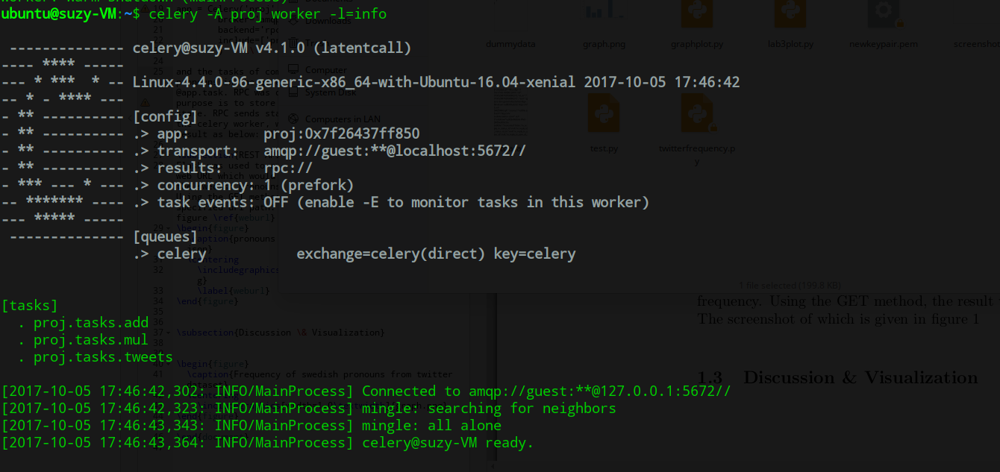
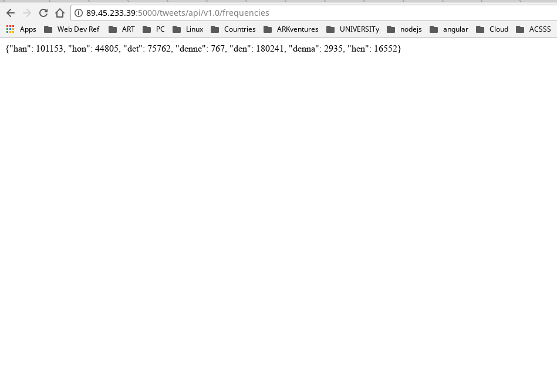
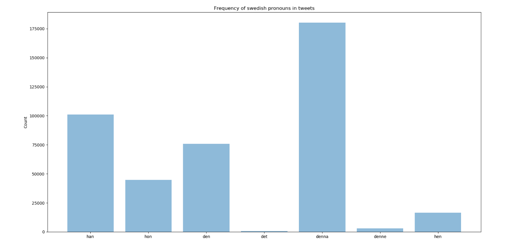

# Prototype system to analyze twitter dataset of tweets collected beforehand from Twitter's datastream API.

The goal of this project is to construct a compute-service based on distributed task queue 'Celery', using RabbitMQ as a message broker. The service is capable of analyzing the dataset on demand. For instance, as shown in the demo/screenshot below, the service is able to calculate the total number of mentions of following Swedish pronouns: han, hon, det, denne, den, denna, hen in the dataset. The dataset used is provided in the github repo (link below).

### Tools/technologies
* A single node Ubuntu 16.04 VM running on Openstack
* Celery as a tak queue
* RabbitMQ as a message broker
* Python as the scripting language
* Flask to expose the endpoint.

### Demo/screenshots

#### Running Celery worker 

#### Service endpoint

#### Data visualization of frequency of pronouns mentions

